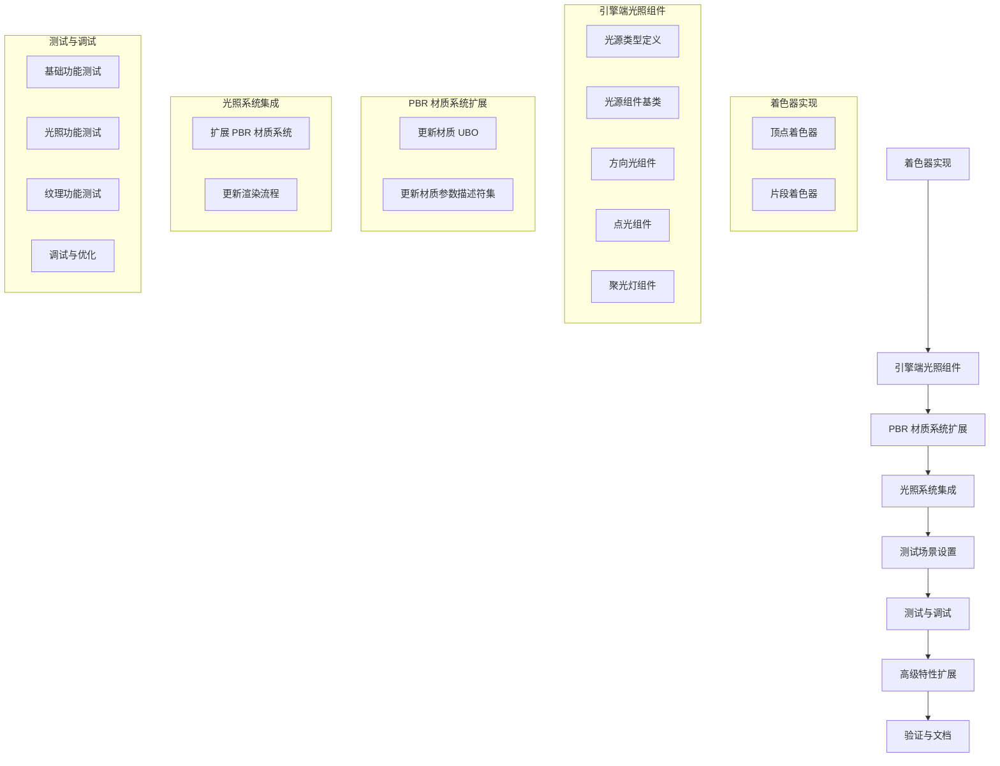

# PBR 光照系统实现 TODO 列表

## 1. 概述

本 TODO 列表详细规划了基于物理渲染（PBR）光照系统的实现步骤，包括着色器开发、引擎端组件实现、系统集成和测试调试。该系统将支持方向光、点光、聚光灯等多种光源类型，并与现有渲染架构无缝集成。

## 2. 前置条件

- 已完成基础渲染架构（Vulkan 设备、渲染通道、管线等）
- 已实现基础材质系统
- 已实现模型加载和渲染
- 已创建 PBR 材质组件和系统

## 3. 着色器实现

### 3.1 PBR 顶点着色器 (`PBR_Forward.vert`)

| 编号 | 任务 | 详细说明 | 状态 |
|------|------|----------|------|
| 1.1.1 | 创建顶点着色器文件 | 在 `/Resource/Shader/` 目录下创建 `PBR_Forward.vert` 文件 | ☐ |
| 1.1.2 | 定义输入输出变量 | 定义顶点属性输入和片段着色器输出变量 | ☐ |
| 1.1.3 | 实现基本变换 | 实现模型-视图-投影变换，计算裁剪空间位置 | ☐ |
| 1.1.4 | 计算世界空间数据 | 计算世界空间位置、法线、切线和副切线 | ☐ |
| 1.1.5 | 传递纹理坐标 | 将纹理坐标传递给片段着色器 | ☐ |

#### 3.1.1 完整代码实现
```glsl
#version 450
#extension GL_KHR_vulkan_glsl : enable

// 顶点属性输入
layout(location=0) in vec3 a_Pos;           // 位置
layout(location=1) in vec2 a_Texcoord;      // 纹理坐标
layout(location=2) in vec3 a_Normal;        // 法线
layout(location=3) in vec3 a_Tangent;       // 切线
layout(location=4) in vec3 a_Bitangent;     // 副切线

// 输出到片段着色器的数据
out gl_PerVertex{
    vec4 gl_Position;                      // 裁剪空间位置
};

layout(location=1) out vec2 v_Texcoord;    // 纹理坐标
layout(location=2) out vec3 v_WorldPos;    // 世界空间位置
layout(location=3) out vec3 v_Normal;      // 世界空间法线
layout(location=4) out vec3 v_Tangent;     // 世界空间切线
layout(location=5) out vec3 v_Bitangent;   // 世界空间副切线

// 帧UBO (Set 0, Binding 0)
layout(set=0, binding=0, std140) uniform FrameUbo{
    mat4  projMat;        // 投影矩阵
    mat4  viewMat;        // 视图矩阵
    ivec2 resolution;     // 分辨率
    uint  frameId;        // 帧ID
    float time;           // 时间
} frameUbo;

// Push Constant (模型矩阵和法线矩阵)
layout(push_constant) uniform PushConstants{
    mat4 modelMat;        // 模型矩阵
    mat3 normalMat;       // 法线矩阵
} PC;

void main(){
    // 计算世界空间位置
    vec4 worldPos = PC.modelMat * vec4(a_Pos, 1.0);
    v_WorldPos = worldPos.xyz;
    
    // 计算世界空间法线
    v_Normal = normalize(PC.normalMat * a_Normal);
    
    // 计算世界空间切线和副切线
    v_Tangent = normalize(PC.normalMat * a_Tangent);
    v_Bitangent = normalize(PC.normalMat * a_Bitangent);
    
    // 传递纹理坐标
    v_Texcoord = a_Texcoord;
    
    // 计算裁剪空间位置
    gl_Position = frameUbo.projMat * frameUbo.viewMat * worldPos;
}
```

### 3.2 PBR 片段着色器 (`PBR_Forward.frag`)

| 编号 | 任务 | 详细说明 | 状态 |
|------|------|----------|------|
| 1.2.1 | 创建片段着色器文件 | 在 `/Resource/Shader/` 目录下创建 `PBR_Forward.frag` 文件 | ☐ |
| 1.2.2 | 定义 UBO 结构体 | 定义材质 UBO、光源 UBO 和光照 UBO 结构体 | ☐ |
| 1.2.3 | 实现 PBR 核心函数 | 实现 Cook-Torrance BRDF 相关函数 | ☐ |
| 1.2.4 | 实现纹理采样逻辑 | 实现基础颜色、法线、金属度-粗糙度、AO、自发光纹理的采样 | ☐ |
| 1.2.5 | 实现法线映射 | 实现基于法线贴图的法线计算和切线空间转换 | ☐ |
| 1.2.6 | 实现单个光源贡献计算 | 实现 `CalculateLightContribution` 函数，支持方向光、点光、聚光灯 | ☐ |
| 1.2.7 | 实现方向光支持 | 实现方向光的光线方向和衰减计算 | ☐ |
| 1.2.8 | 实现点光支持 | 实现点光的光线方向和距离衰减计算 | ☐ |
| 1.2.9 | 实现聚光灯支持 | 实现聚光灯的光线方向、距离衰减和角度衰减计算 | ☐ |
| 1.2.10 | 实现环境光计算 | 实现基于环境光颜色和强度的环境光照 | ☐ |
| 1.2.11 | 实现最终颜色计算 | 合并环境光和所有直接光源的贡献，添加自发光效果 | ☐ |
| 1.2.12 | 实现色调映射和 Gamma 校正 | 实现 Reinhard 色调映射和 Gamma 校正 | ☐ |

#### 3.2.1 完整代码实现
```glsl
#version 450
#extension GL_KHR_vulkan_glsl : enable

// 从顶点着色器输入的数据
layout(location=1) in vec2 v_Texcoord;    // 纹理坐标
layout(location=2) in vec3 v_WorldPos;    // 世界空间位置
layout(location=3) in vec3 v_Normal;      // 世界空间法线
layout(location=4) in vec3 v_Tangent;     // 世界空间切线
layout(location=5) in vec3 v_Bitangent;   // 世界空间副切线

// 输出颜色
layout(location=0) out vec4 fragColor;

// 帧UBO (Set 0, Binding 0)
layout(set=0, binding=0, std140) uniform FrameUbo{
    mat4  projMat;        // 投影矩阵
    mat4  viewMat;        // 视图矩阵
    ivec2 resolution;     // 分辨率
    uint  frameId;        // 帧ID
    float time;           // 时间
} frameUbo;

// PBR材质UBO (Set 1, Binding 0)
layout(set=1, binding=0, std140) uniform PBRMaterialUbo{
    alignas(16) vec4 baseColorFactor;     // 基础颜色因子
    alignas(4) float metallicFactor;      // 金属度因子
    alignas(4) float roughnessFactor;     // 粗糙度因子
    alignas(4) float aoFactor;            // AO因子
    alignas(4) float emissiveFactor;      // 自发光因子
    alignas(16) TextureParam baseColorTextureParam;     // 基础颜色纹理参数
    alignas(16) TextureParam normalTextureParam;         // 法线纹理参数
    alignas(16) TextureParam metallicRoughnessTextureParam; // 金属度-粗糙度纹理参数
    alignas(16) TextureParam aoTextureParam;              // AO纹理参数
    alignas(16) TextureParam emissiveTextureParam;         // 自发光纹理参数
} materialUbo;

// 纹理参数结构体
struct TextureParam{
    bool  enable;         // 是否启用纹理
    float uvRotation;     // UV旋转角度
    vec4  uvTransform;    // UV变换 (x,y: 缩放, z,w: 平移)
};

// 光源UBO结构体
struct LightUbo {
    vec4 position;           // 光源位置 (方向光: w=0, 点光/聚光灯: w=1)
    vec3 direction;          // 光源方向 (仅方向光和聚光灯)
    float range;             // 光源范围 (仅点光和聚光灯)
    
    vec3 color;              // 光源颜色
    float intensity;         // 光源强度
    
    float spotInnerCutoff;   // 聚光灯内圆锥角（余弦值）
    float spotOuterCutoff;   // 聚光灯外圆锥角（余弦值）
    float attenuationConstant; // 衰减常数项
    float attenuationLinear;   // 衰减线性项
    
    float attenuationQuadratic; // 衰减二次项
    uint32_t type;             // 光源类型
    uint32_t enabled;          // 是否启用
    float padding;             // 对齐填充
};

// 光照UBO (Set 2, Binding 0)
layout(set=2, binding=0, std140) uniform LightingUbo{
    LightUbo lights[16];     // 支持最多16个光源
    vec3 ambientColor;       // 环境光颜色
    float ambientIntensity;  // 环境光强度
    uint32_t numLights;      // 实际光源数量
    uint32_t padding[3];     // 对齐填充
} lightingUbo;

// 纹理资源 (Set 3, Binding X)
layout(set=3, binding=0) uniform sampler2D baseColorTexture;       // 基础颜色纹理
layout(set=3, binding=1) uniform sampler2D normalTexture;           // 法线纹理
layout(set=3, binding=2) uniform sampler2D metallicRoughnessTexture; // 金属度-粗糙度纹理
layout(set=3, binding=3) uniform sampler2D aoTexture;                // AO纹理
layout(set=3, binding=4) uniform sampler2D emissiveTexture;           // 自发光纹理

// 纹理坐标变换函数
vec2 getTextureUV(TextureParam param, vec2 inUV){
    vec2 retUV = inUV;
    
    // 应用UV缩放
    retUV *= param.uvTransform.xy;
    
    // 应用UV旋转
    float cosRot = cos(param.uvRotation);
    float sinRot = sin(param.uvRotation);
    retUV = vec2(
        retUV.x * cosRot - retUV.y * sinRot,
        retUV.x * sinRot + retUV.y * cosRot
    );
    
    // 应用UV平移
    retUV += param.uvTransform.zw;
    
    return retUV;
}

// PBR核心函数

// 法线分布函数 (Trowbridge-Reitz GGX)
float DistributionGGX(vec3 N, vec3 H, float roughness) {
    float a = roughness * roughness;
    float a2 = a * a;
    float NdotH = max(dot(N, H), 0.0);
    float NdotH2 = NdotH * NdotH;

    float nom = a2;
    float denom = (NdotH2 * (a2 - 1.0) + 1.0);
    denom = 3.141592653589793 * denom * denom;

    return nom / denom;
}

// 几何遮挡函数 (Schlick-GGX)
float GeometrySchlickGGX(float NdotV, float roughness) {
    float r = (roughness + 1.0);
    float k = (r * r) / 8.0;

    float nom = NdotV;
    float denom = NdotV * (1.0 - k) + k;

    return nom / denom;
}

// 几何遮挡函数 (Smith)
float GeometrySmith(vec3 N, vec3 V, vec3 L, float roughness) {
    float NdotV = max(dot(N, V), 0.0);
    float NdotL = max(dot(N, L), 0.0);
    float ggx1 = GeometrySchlickGGX(NdotV, roughness);
    float ggx2 = GeometrySchlickGGX(NdotL, roughness);

    return ggx1 * ggx2;
}

// 菲涅尔方程 (Schlick)
vec3 FresnelSchlick(float cosTheta, vec3 F0) {
    return F0 + (1.0 - F0) * pow(clamp(1.0 - cosTheta, 0.0, 1.0), 5.0);
}

// 计算单个光源的贡献
vec3 CalculateLightContribution(LightUbo light, vec3 N, vec3 V, vec3 albedo, float metallic, float roughness, float ao, vec3 worldPos) {
    // 如果光源未启用，直接返回黑色
    if (light.enabled == 0) {
        return vec3(0.0);
    }

    vec3 L;
    float attenuation = 1.0;

    // 根据光源类型计算光线方向和衰减
    if (light.type == 0) { // 方向光
        L = normalize(-light.direction);
        // 方向光没有衰减，保持attenuation为1.0
    } 
    else if (light.type == 1) { // 点光
        // 计算光线方向（从表面点指向光源）
        L = normalize(light.position.xyz - worldPos);
        
        // 计算距离和衰减
        float distance = length(light.position.xyz - worldPos);
        attenuation = 1.0 / (light.attenuationConstant + 
                            light.attenuationLinear * distance + 
                            light.attenuationQuadratic * (distance * distance));
        
        // 超出范围则衰减为0
        if (distance > light.range) {
            attenuation = 0.0;
        }
    } 
    else if (light.type == 2) { // 聚光灯
        // 计算光线方向（从表面点指向光源）
        L = normalize(light.position.xyz - worldPos);
        
        // 计算距离和衰减
        float distance = length(light.position.xyz - worldPos);
        attenuation = 1.0 / (light.attenuationConstant + 
                            light.attenuationLinear * distance + 
                            light.attenuationQuadratic * (distance * distance));
        
        // 超出范围则衰减为0
        if (distance > light.range) {
            attenuation = 0.0;
        } 
        else {
            // 计算聚光灯角度衰减
            float theta = dot(L, normalize(-light.direction));
            float epsilon = light.spotInnerCutoff - light.spotOuterCutoff;
            float spotAttenuation = clamp((theta - light.spotOuterCutoff) / epsilon, 0.0, 1.0);
            attenuation *= spotAttenuation;
        }
    }

    // 计算半程向量（光线方向和视线方向的中间向量）
    vec3 H = normalize(V + L);

    // 计算漫反射和镜面反射分量
    vec3 F0 = vec3(0.04); // 非金属的基础反射率
    F0 = mix(F0, albedo, metallic); // 金属的基础反射率等于其颜色

    // 计算 Cook-Torrance BRDF 分量
    float NDF = DistributionGGX(N, H, roughness); // 法线分布函数
    float G = GeometrySmith(N, V, L, roughness); // 几何遮挡函数
    vec3 F = FresnelSchlick(max(dot(H, V), 0.0), F0); // 菲涅尔方程

    // 分离漫反射和镜面反射
    vec3 kS = F; // 镜面反射系数
    vec3 kD = vec3(1.0) - kS; // 漫反射系数
    kD *= 1.0 - metallic; // 金属没有漫反射分量

    // 计算 Cook-Torrance BRDF
    vec3 numerator = NDF * G * F;
    float denominator = 4.0 * max(dot(N, V), 0.0) * max(dot(N, L), 0.0) + 0.0001; // 避免除零
    vec3 specular = numerator / denominator;

    // 计算漫反射和镜面反射贡献
    float NdotL = max(dot(N, L), 0.0);
    vec3 radiance = light.color * light.intensity * NdotL * attenuation;

    // 最终光贡献
    vec3 finalColor = (kD * albedo / 3.141592653589793 + specular) * radiance;

    return finalColor;
}

void main(){
    // 获取视角方向（从像素到摄像机）
    vec3 viewPos = inverse(frameUbo.viewMat)[3].xyz; // 摄像机位置在世界空间
    vec3 V = normalize(viewPos - v_WorldPos);

    // 1. 采样纹理并获取材质属性
    
    // 1.1 基础颜色
    vec3 albedo = materialUbo.baseColorFactor.rgb;
    if (materialUbo.baseColorTextureParam.enable) {
        vec2 uv = getTextureUV(materialUbo.baseColorTextureParam, v_Texcoord);
        albedo = texture(baseColorTexture, uv).rgb;
    }

    // 1.2 法线映射
    vec3 N = normalize(v_Normal);
    if (materialUbo.normalTextureParam.enable) {
        vec2 uv = getTextureUV(materialUbo.normalTextureParam, v_Texcoord);
        vec3 normalMap = texture(normalTexture, uv).rgb * 2.0 - 1.0;
        
        // 构建切线空间矩阵
        vec3 T = normalize(v_Tangent - dot(v_Tangent, N) * N);
        vec3 B = cross(N, T);
        if (dot(cross(T, B), N) < 0.0) {
            T = T * -1.0;
        }
        mat3 TBN = mat3(T, B, N);
        
        // 转换法线到世界空间
        N = normalize(TBN * normalMap);
    }

    // 1.3 金属度和粗糙度
    float metallic = materialUbo.metallicFactor;
    float roughness = materialUbo.roughnessFactor;
    if (materialUbo.metallicRoughnessTextureParam.enable) {
        vec2 uv = getTextureUV(materialUbo.metallicRoughnessTextureParam, v_Texcoord);
        vec4 mrSample = texture(metallicRoughnessTexture, uv);
        metallic = mrSample.b; // 金属度通常存储在B通道
        roughness = mrSample.g; // 粗糙度通常存储在G通道
    }

    // 1.4 AO（环境光遮蔽）
    float ao = materialUbo.aoFactor;
    if (materialUbo.aoTextureParam.enable) {
        vec2 uv = getTextureUV(materialUbo.aoTextureParam, v_Texcoord);
        ao = texture(aoTexture, uv).r;
    }

    // 1.5 自发光
    vec3 emissive = vec3(0.0);
    if (materialUbo.emissiveTextureParam.enable) {
        vec2 uv = getTextureUV(materialUbo.emissiveTextureParam, v_Texcoord);
        emissive = texture(emissiveTexture, uv).rgb * materialUbo.emissiveFactor;
    }

    // 2. 计算直接光照
    
    // 2.1 环境光贡献
    vec3 ambient = lightingUbo.ambientColor * lightingUbo.ambientIntensity * albedo * ao;

    // 2.2 直接光照贡献
    vec3 directLighting = vec3(0.0);
    for (uint32_t i = 0; i < lightingUbo.numLights; i++) {
        directLighting += CalculateLightContribution(lightingUbo.lights[i], N, V, albedo, metallic, roughness, ao, v_WorldPos);
    }

    // 3. 最终颜色计算
    vec3 finalColor = ambient + directLighting + emissive;

    // 4. 色调映射（简单的 Reinhard 色调映射）
    finalColor = finalColor / (finalColor + vec3(1.0));
    finalColor = pow(finalColor, vec3(1.0/2.2)); // Gamma校正

    // 输出最终颜色
    fragColor = vec4(finalColor, 1.0);
}
```

## 4. 引擎端光照组件实现

### 4.1 光源类型定义

| 编号 | 任务 | 详细说明 | 状态 |
|------|------|----------|------|
| 2.1.1 | 定义光源类型枚举 | 在 `Core/public/ECS/Component/AdLightComponent.h` 中定义光源类型枚举 | ☐ |
| 2.1.2 | 定义光源 UBO 结构体 | 定义 `LightUbo` 结构体，包含所有光源参数 | ☐ |
| 2.1.3 | 定义光照 UBO 结构体 | 定义 `LightingUbo` 结构体，包含光源数组和环境光参数 | ☐ |

#### 4.1.1 完整代码实现 (`Core/public/ECS/Component/AdLightComponent.h`)
```cpp
#pragma once

#include "ECS/AdComponent.h"
#include <glm/glm.hpp>

namespace WuDu {

// 光源类型枚举
enum class LightType {
    LIGHT_TYPE_DIRECTIONAL = 0,  // 方向光
    LIGHT_TYPE_POINT,            // 点光
    LIGHT_TYPE_SPOT              // 聚光灯
};

// 光源UBO结构体
struct LightUbo {
    alignas(16) glm::vec4 position;           // 光源位置 (方向光: w=0, 点光/聚光灯: w=1)
    alignas(16) glm::vec3 direction;          // 光源方向 (仅方向光和聚光灯)
    alignas(4) float range;                   // 光源范围 (仅点光和聚光灯)
    
    alignas(16) glm::vec3 color;              // 光源颜色
    alignas(4) float intensity;               // 光源强度
    
    // 聚光灯参数
    alignas(4) float spotInnerCutoff;         // 聚光灯内圆锥角（余弦值）
    alignas(4) float spotOuterCutoff;         // 聚光灯外圆锥角（余弦值）
    alignas(4) float attenuationConstant;     // 衰减常数项
    alignas(4) float attenuationLinear;       // 衰减线性项
    
    alignas(4) float attenuationQuadratic;    // 衰减二次项
    alignas(4) uint32_t type;                 // 光源类型
    alignas(4) uint32_t enabled;              // 是否启用
    alignas(4) float padding;                 // 对齐填充
};

// 光照UBO结构体
struct LightingUbo {
    alignas(16) LightUbo lights[16];         // 支持最多16个光源
    alignas(16) glm::vec3 ambientColor;       // 环境光颜色
    alignas(4) float ambientIntensity;        // 环境光强度
    alignas(4) uint32_t numLights;            // 实际光源数量
    alignas(4) uint32_t padding[3];           // 对齐填充
};

// 光源组件基类
class AdLightComponent : public AdComponent {
public:
    AdLightComponent() = default;
    virtual ~AdLightComponent() = default;
    
    // 组件生命周期方法
    void OnInit() override {}
    void OnUpdate(float deltaTime) override {}
    void OnDestroy() override {}
    
    // 获取光源UBO数据（纯虚函数，子类必须实现）
    virtual LightUbo GetLightUbo() const = 0;
    
    // 光源属性设置方法
    void SetColor(const glm::vec3& color) { mColor = color; mDirty = true; }
    void SetIntensity(float intensity) { mIntensity = intensity; mDirty = true; }
    void SetEnabled(bool enabled) { mEnabled = enabled; mDirty = true; }
    
    // 获取光源属性
    const glm::vec3& GetColor() const { return mColor; }
    float GetIntensity() const { return mIntensity; }
    bool IsEnabled() const { return mEnabled; }
    
    // 检查光源是否需要更新
    bool IsDirty() const { return mDirty; }
    void ClearDirty() { mDirty = false; }
    
protected:
    glm::vec3 mColor{1.0f, 1.0f, 1.0f};  // 光源颜色
    float mIntensity{1.0f};               // 光源强度
    bool mEnabled{true};                  // 是否启用
    bool mDirty{true};                    // 标记光源数据是否需要更新
};

// 方向光组件
class AdDirectionalLightComponent : public AdLightComponent {
public:
    AdDirectionalLightComponent() : AdLightComponent(), mDirection(0.0f, -1.0f, 0.0f) {}
    
    LightUbo GetLightUbo() const override {
        LightUbo ubo{};
        
        // 方向光的位置w分量为0，表示这是一个方向向量
        ubo.position = glm::vec4(mDirection, 0.0f);
        ubo.direction = mDirection;
        
        // 设置光源颜色和强度
        ubo.color = GetColor();
        ubo.intensity = GetIntensity();
        
        // 设置光源类型和启用状态
        ubo.type = static_cast<uint32_t>(LightType::LIGHT_TYPE_DIRECTIONAL);
        ubo.enabled = IsEnabled() ? 1 : 0;
        
        return ubo;
    }
    
    // 方向光特有方法
    void SetDirection(const glm::vec3& direction) { 
        mDirection = glm::normalize(direction); 
        mDirty = true; 
    }
    
    const glm::vec3& GetDirection() const { return mDirection; }
    
private:
    glm::vec3 mDirection;  // 光源方向（已归一化）
};

// 点光组件
class AdPointLightComponent : public AdLightComponent {
public:
    AdPointLightComponent() : AdLightComponent(), mRange(10.0f) {
        // 设置默认衰减参数
        mAttenuationConstant = 1.0f;
        mAttenuationLinear = 0.14f;
        mAttenuationQuadratic = 0.07f;
    }
    
    LightUbo GetLightUbo() const override {
        LightUbo ubo{};
        
        // 获取实体变换组件，计算世界空间位置
        auto& transformComp = GetEntity()->GetComponent<AdTransformComponent>();
        glm::vec3 worldPos = transformComp.GetWorldPosition();
        
        // 点光的位置w分量为1，表示这是一个位置点
        ubo.position = glm::vec4(worldPos, 1.0f);
        
        // 设置光源颜色和强度
        ubo.color = GetColor();
        ubo.intensity = GetIntensity();
        
        // 设置点光特有参数
        ubo.range = mRange;
        ubo.attenuationConstant = mAttenuationConstant;
        ubo.attenuationLinear = mAttenuationLinear;
        ubo.attenuationQuadratic = mAttenuationQuadratic;
        
        // 设置光源类型和启用状态
        ubo.type = static_cast<uint32_t>(LightType::LIGHT_TYPE_POINT);
        ubo.enabled = IsEnabled() ? 1 : 0;
        
        return ubo;
    }
    
    // 点光特有属性设置方法
    void SetRange(float range) { mRange = range; mDirty = true; }
    void SetAttenuation(float constant, float linear, float quadratic) {
        mAttenuationConstant = constant;
        mAttenuationLinear = linear;
        mAttenuationQuadratic = quadratic;
        mDirty = true;
    }
    
    // 获取点光属性
    float GetRange() const { return mRange; }
    float GetAttenuationConstant() const { return mAttenuationConstant; }
    float GetAttenuationLinear() const { return mAttenuationLinear; }
    float GetAttenuationQuadratic() const { return mAttenuationQuadratic; }
    
private:
    float mRange;                      // 光源范围
    float mAttenuationConstant;        // 衰减常数项
    float mAttenuationLinear;          // 衰减线性项
    float mAttenuationQuadratic;       // 衰减二次项
};

// 聚光灯组件
class AdSpotLightComponent : public AdLightComponent {
public:
    AdSpotLightComponent() : AdLightComponent(), mRange(10.0f) {
        // 设置默认衰减参数
        mAttenuationConstant = 1.0f;
        mAttenuationLinear = 0.14f;
        mAttenuationQuadratic = 0.07f;
        
        // 设置默认聚光灯角度（内圆锥角30度，外圆锥角45度）
        SetSpotCutoff(glm::radians(30.0f), glm::radians(45.0f));
    }
    
    LightUbo GetLightUbo() const override {
        LightUbo ubo{};
        
        // 获取实体变换组件，计算世界空间位置和方向
        auto& transformComp = GetEntity()->GetComponent<AdTransformComponent>();
        glm::vec3 worldPos = transformComp.GetWorldPosition();
        glm::vec3 worldDir = transformComp.GetForwardDirection();
        
        // 聚光灯的位置w分量为1，表示这是一个位置点
        ubo.position = glm::vec4(worldPos, 1.0f);
        ubo.direction = worldDir;
        
        // 设置光源颜色和强度
        ubo.color = GetColor();
        ubo.intensity = GetIntensity();
        
        // 设置聚光灯特有参数
        ubo.range = mRange;
        ubo.attenuationConstant = mAttenuationConstant;
        ubo.attenuationLinear = mAttenuationLinear;
        ubo.attenuationQuadratic = mAttenuationQuadratic;
        ubo.spotInnerCutoff = mSpotInnerCutoff;
        ubo.spotOuterCutoff = mSpotOuterCutoff;
        
        // 设置光源类型和启用状态
        ubo.type = static_cast<uint32_t>(LightType::LIGHT_TYPE_SPOT);
        ubo.enabled = IsEnabled() ? 1 : 0;
        
        return ubo;
    }
    
    // 聚光灯特有属性设置方法
    void SetRange(float range) { mRange = range; mDirty = true; }
    void SetAttenuation(float constant, float linear, float quadratic) {
        mAttenuationConstant = constant;
        mAttenuationLinear = linear;
        mAttenuationQuadratic = quadratic;
        mDirty = true;
    }
    void SetSpotCutoff(float innerCutoff, float outerCutoff) {
        // 存储余弦值，避免在着色器中重复计算
        mSpotInnerCutoff = cos(innerCutoff);
        mSpotOuterCutoff = cos(outerCutoff);
        mDirty = true;
    }
    
    // 获取聚光灯属性
    float GetRange() const { return mRange; }
    float GetSpotInnerCutoff() const { return acos(mSpotInnerCutoff); }
    float GetSpotOuterCutoff() const { return acos(mSpotOuterCutoff); }
    
private:
    float mRange;                      // 光源范围
    float mAttenuationConstant;        // 衰减常数项
    float mAttenuationLinear;          // 衰减线性项
    float mAttenuationQuadratic;       // 衰减二次项
    float mSpotInnerCutoff;            // 内圆锥角（余弦值）
    float mSpotOuterCutoff;            // 外圆锥角（余弦值）
};

} // namespace WuDu
```

### 4.2 光源组件实现

| 编号 | 任务 | 详细说明 | 状态 |
|------|------|----------|------|
| 2.2.1 | 创建光源组件基类 | 创建 `AdLightComponent` 基类，包含通用光源属性和方法 | ☐ |
| 2.2.2 | 实现通用属性访问方法 | 实现设置颜色、强度、启用状态的方法 | ☐ |
| 2.2.3 | 定义纯虚函数 `GetLightUbo` | 用于获取光源 UBO 数据 | ☐ |
| 2.3.1 | 创建方向光组件类 | 创建 `AdDirectionalLightComponent` 继承自 `AdLightComponent` | ☐ |
| 2.3.2 | 实现方向光特有属性 | 添加方向属性和设置方法 | ☐ |
| 2.3.3 | 实现 `GetLightUbo` 方法 | 生成方向光的 UBO 数据 | ☐ |
| 2.4.1 | 创建点光组件类 | 创建 `AdPointLightComponent` 继承自 `AdLightComponent` | ☐ |
| 2.4.2 | 实现点光特有属性 | 添加范围、衰减系数等属性和设置方法 | ☐ |
| 2.4.3 | 实现 `GetLightUbo` 方法 | 生成点光的 UBO 数据 | ☐ |
| 2.5.1 | 创建聚光灯组件类 | 创建 `AdSpotLightComponent` 继承自 `AdLightComponent` | ☐ |
| 2.5.2 | 实现聚光灯特有属性 | 添加方向、内/外圆锥角、范围、衰减系数等属性和设置方法 | ☐ |
| 2.5.3 | 实现 `GetLightUbo` 方法 | 生成聚光灯的 UBO 数据 | ☐ |

#### 4.2.1 完整代码实现 (`Core/private/ECS/Component/AdLightComponent.cpp`)
```cpp
#include "ECS/Component/AdLightComponent.h"
#include "ECS/AdEntity.h"
#include "ECS/Component/AdTransformComponent.h"

namespace WuDu {

// 方向光组件实现已在头文件中完成（内联函数）
// 点光组件实现已在头文件中完成（内联函数）
// 聚光灯组件实现已在头文件中完成（内联函数）

} // namespace WuDu
```

## 5. PBR 材质系统扩展

### 5.1 更新 PBR 材质 UBO

| 编号 | 任务 | 详细说明 | 状态 |
|------|------|----------|------|
| 3.1.1 | 确保 PBR 材质 UBO 完整 | 检查 `PBRMaterialUbo` 结构体，确保包含所有必要的纹理参数 | ☐ |
| 3.1.2 | 验证纹理参数结构 | 确保 `TextureParam` 结构体与着色器中的定义一致 | ☐ |

#### 5.1.1 完整代码实现 (`Core/public/ECS/Component/Material/AdPBRMaterialComponent.h`)
```cpp
#pragma once

#include "ECS/Component/Material/AdMaterialComponent.h"
#include "Render/AdMaterial.h"

namespace WuDu {
    // PBR材质纹理枚举
    enum PBRMaterialTexture {
        PBR_MAT_BASE_COLOR,      // 基础颜色纹理
        PBR_MAT_NORMAL,          // 法线纹理
        PBR_MAT_METALLIC_ROUGHNESS, // 金属度-粗糙度纹理（R通道：粗糙度，B通道：金属度）
        PBR_MAT_AO,              // 环境光遮蔽纹理
        PBR_MAT_EMISSIVE         // 自发光纹理
    };

    // 帧UBO结构体
    struct FrameUbo {
        glm::mat4  projMat{ 1.f };
        glm::mat4  viewMat{ 1.f };
        alignas(8) glm::ivec2 resolution;
        alignas(4) uint32_t frameId;
        alignas(4) float time;
    };

    // 纹理参数结构体
    struct TextureParam {
        bool enable = false;
        float uvRotation = 0.0f;
        glm::vec2 uvTranslation{ 0.f, 0.f };
        float uvScale = 1.0f;
    };

    // PBR材质UBO结构体
    struct PBRMaterialUbo {
        alignas(16) glm::vec4 baseColorFactor;     // 基础颜色因子
        alignas(4) float metallicFactor;            // 金属度因子
        alignas(4) float roughnessFactor;           // 粗糙度因子
        alignas(4) float aoFactor;                  // AO因子
        alignas(4) float emissiveFactor;            // 自发光因子
        alignas(16) TextureParam baseColorTextureParam;     // 基础颜色纹理参数
        alignas(16) TextureParam normalTextureParam;         // 法线纹理参数
        alignas(16) TextureParam metallicRoughnessTextureParam; // 金属度-粗糙度纹理参数
        alignas(16) TextureParam aoTextureParam;              // AO纹理参数
        alignas(16) TextureParam emissiveTextureParam;         // 自发光纹理参数
    };

    // PBR材质类
    class AdPBRMaterial : public AdMaterial {
    public:
        // 获取材质参数
        const PBRMaterialUbo& GetParams() const { return mParams; }
        
        // 获取材质属性
        const glm::vec4& GetBaseColorFactor() const { return mParams.baseColorFactor; }
        float GetMetallicFactor() const { return mParams.metallicFactor; }
        float GetRoughnessFactor() const { return mParams.roughnessFactor; }
        float GetAoFactor() const { return mParams.aoFactor; }
        float GetEmissiveFactor() const { return mParams.emissiveFactor; }
        
        // 设置材质属性
        void SetBaseColorFactor(const glm::vec4& color) {
            mParams.baseColorFactor = color;
            bShouldFlushParams = true;
        }
        
        void SetMetallicFactor(float metallic) {
            mParams.metallicFactor = metallic;
            bShouldFlushParams = true;
        }
        
        void SetRoughnessFactor(float roughness) {
            mParams.roughnessFactor = roughness;
            bShouldFlushParams = true;
        }
        
        void SetAoFactor(float ao) {
            mParams.aoFactor = ao;
            bShouldFlushParams = true;
        }
        
        void SetEmissiveFactor(float emissive) {
            mParams.emissiveFactor = emissive;
            bShouldFlushParams = true;
        }
        
private:
        PBRMaterialUbo mParams{};
    };

    // PBR材质组件类
    class AdPBRMaterialComponent : public AdMaterialComponent<AdPBRMaterial> {
    };
} // namespace WuDu
```

### 5.2 更新材质参数描述符集

| 编号 | 任务 | 详细说明 | 状态 |
|------|------|----------|------|
| 3.2.1 | 实现 `UpdateMaterialParamsDescSet` | 确保已实现该函数，更新所有纹理参数 | ☐ |
| 3.2.2 | 验证纹理参数更新逻辑 | 确保正确调用 `AdMaterial::UpdateTextureParams` 更新纹理参数 | ☐ |

#### 5.2.1 完整代码实现 (`Core/private/ECS/System/AdPBRMaterialSystem.cpp`)
```cpp
// 更新材质参数描述符集
void AdPBRMaterialSystem::UpdateMaterialParamsDescSet(VkDescriptorSet descSet, AdPBRMaterial* material){
    AdVKDevice* device = GetDevice();

    AdVKBuffer* materialBuffer = mMaterialBuffers[material->GetIndex()].get();
    
    //获取材质参数
    PBRMaterialUbo params = material->GetParams();

    //更新基础颜色纹理参数
    const TextureView* baseColorTexture = material->GetTextureView(PBR_MAT_BASE_COLOR);
    if (baseColorTexture) {
        AdMaterial::UpdateTextureParams(baseColorTexture, &params.baseColorTextureParam);
    }

    //更新法线纹理参数
    const TextureView* normalTexture = material->GetTextureView(PBR_MAT_NORMAL);
    if (normalTexture) {
        AdMaterial::UpdateTextureParams(normalTexture, &params.normalTextureParam);
    }

    //更新金属度-粗糙度纹理参数
    const TextureView* metallicRoughnessTexture = material->GetTextureView(PBR_MAT_METALLIC_ROUGHNESS);
    if (metallicRoughnessTexture) {
        AdMaterial::UpdateTextureParams(metallicRoughnessTexture, &params.metallicRoughnessTextureParam);
    }

    //更新环境光遮蔽纹理参数
    const TextureView* aoTexture = material->GetTextureView(PBR_MAT_AO);
    if (aoTexture) {
        AdMaterial::UpdateTextureParams(aoTexture, &params.aoTextureParam);
    }

    //更新自发光纹理参数
    const TextureView* emissiveTexture = material->GetTextureView(PBR_MAT_EMISSIVE);
    if (emissiveTexture) {
        AdMaterial::UpdateTextureParams(emissiveTexture, &params.emissiveTextureParam);
    }

    //写入缓冲区并更新描述符集
    materialBuffer->WriteData(&params);
    VkDescriptorBufferInfo bufferInfo = DescriptorSetWriter::BuildBufferInfo(materialBuffer->GetHandle(), 0, sizeof(params));
    VkWriteDescriptorSet bufferWrite = DescriptorSetWriter::WriteBuffer(descSet, 0, VK_DESCRIPTOR_TYPE_UNIFORM_BUFFER, &bufferInfo);
    DescriptorSetWriter::UpdateDescriptorSets(device->GetHandle(), { bufferWrite });
}
```

## 6. 光照系统集成

### 6.1 扩展 PBR 材质系统

| 编号 | 任务 | 详细说明 | 状态 |
|------|------|----------|------|
| 4.1.1 | 添加光照 UBO 支持 | 在 `AdPBRMaterialSystem` 类中添加光照 UBO 缓冲区和描述符集支持 | ☐ |
| 4.1.2 | 创建光照描述符集布局 | 定义光照 UBO 的描述符集布局 | ☐ |
| 4.1.3 | 更新管线布局 | 在管线布局中添加光照描述符集布局 | ☐ |
| 4.1.4 | 实现光照 UBO 更新方法 | 实现 `UpdateLightingUboDescSet` 方法，收集并更新所有光源数据 | ☐ |

#### 6.1.1 完整代码实现 (`Core/public/ECS/System/AdPBRMaterialSystem.h`)
```cpp
#pragma once

#include "ECS/System/AdMaterialSystem.h"
#include "ECS/Component/Material/AdPBRMaterialComponent.h"
#include "ECS/Component/AdLightComponent.h" // 添加光照组件支持

namespace WuDu {
#define NUM_MATERIAL_BATCH              16
#define NUM_MATERIAL_BATCH_MAX          2048
#define MAX_LIGHTS                      16 // 支持最多16个光源

    class AdVKPipelineLayout;
    class AdVKPipeline;
    class AdVKDescriptorSetLayout;
    class AdVKDescriptorPool;

    class AdPBRMaterialSystem : public AdMaterialSystem {
    public:
        void OnInit(AdVKRenderPass* renderPass) override;
        void OnRender(VkCommandBuffer cmdbuffer, AdRenderTarget* renderTarget) override;
        void OnDestroy() override;
    private:
        void ReCreateMaterialDescPool(uint32_t materialCount);
        void UpdateFrameUboDescSet(AdRenderTarget* renderTarget);
        void UpdateMaterialParamsDescSet(VkDescriptorSet descSet, AdPBRMaterial* metarial);
        void UpdateMaterialResourceDescSet(VkDescriptorSet descSet, AdPBRMaterial* material);
        void UpdateLightingUboDescSet(); // 新增光照UBO更新方法

        std::shared_ptr<AdVKDescriptorSetLayout> mFrameUboDescSetLayout;
        std::shared_ptr<AdVKDescriptorSetLayout> mMaterialParamDescSetLayout;
        std::shared_ptr<AdVKDescriptorSetLayout> mLightingDescSetLayout; // 新增光照描述符集布局
        std::shared_ptr<AdVKDescriptorSetLayout> mMaterialResourceDescSetLayout;

        std::shared_ptr<AdVKPipelineLayout> mPipelineLayout;
        std::shared_ptr<AdVKPipeline> mPipeline;

        std::shared_ptr<AdVKDescriptorPool> mDescriptorPool;
        std::shared_ptr<AdVKDescriptorPool> mMaterialDescriptorPool;

        VkDescriptorSet mFrameUboDescSet;
        VkDescriptorSet mLightingDescSet; // 新增光照描述符集
        std::shared_ptr<AdVKBuffer> mFrameUboBuffer;
        std::shared_ptr<AdVKBuffer> mLightingUboBuffer; // 新增光照UBO缓冲区

        uint32_t mLastDescriptorSetCount = 0;
        std::vector<VkDescriptorSet> mMaterialDescSets;
        std::vector<VkDescriptorSet> mMaterialResourceDescSets;
        std::vector<std::shared_ptr<AdVKBuffer>> mMaterialBuffers;
        std::shared_ptr<AdTexture> mDefaultTexture;
        std::shared_ptr<AdSampler> mDefaultSampler;

        // 环境光参数
        glm::vec3 mAmbientColor{0.1f, 0.1f, 0.1f};
        float mAmbientIntensity{1.0f};
    };
} // namespace WuDu
```

#### 6.1.2 完整代码实现 (`Core/private/ECS/System/AdPBRMaterialSystem.cpp`)
```cpp
// 初始化PBR材质渲染系统
void AdPBRMaterialSystem::OnInit(AdVKRenderPass* renderPass) {
    AdVKDevice* device = GetDevice();

    // 创建帧UBO描述符布局，用于存储投影矩阵和纹理等每一帧更新的数据
    {
        const std::vector<VkDescriptorSetLayoutBinding> bindings = {
            {
                .binding = 0,
                .descriptorType = VK_DESCRIPTOR_TYPE_UNIFORM_BUFFER,
                .descriptorCount = 1,
                .stageFlags = VK_SHADER_STAGE_VERTEX_BIT | VK_SHADER_STAGE_FRAGMENT_BIT,
            }
        };
        mFrameUboDescSetLayout = std::make_shared<AdVKDescriptorSetLayout>(device, bindings);
    }
    
    // 创建材质参数描述符布局
    {
        const std::vector<VkDescriptorSetLayoutBinding> bindings = {
            {
                .binding = 0,
                .descriptorType = VK_DESCRIPTOR_TYPE_UNIFORM_BUFFER,
                .descriptorCount = 1,
                .stageFlags = VK_SHADER_STAGE_FRAGMENT_BIT,
            }
        };
        mMaterialParamDescSetLayout = std::make_shared<AdVKDescriptorSetLayout>(device, bindings);
    }
    
    // 新增：创建光照UBO描述符布局
    {
        const std::vector<VkDescriptorSetLayoutBinding> bindings = {
            {
                .binding = 0,
                .descriptorType = VK_DESCRIPTOR_TYPE_UNIFORM_BUFFER,
                .descriptorCount = 1,
                .stageFlags = VK_SHADER_STAGE_FRAGMENT_BIT,
            }
        };
        mLightingDescSetLayout = std::make_shared<AdVKDescriptorSetLayout>(device, bindings);
    }

    // 创建材质资源描述符布局，用于存储材质参数和纹理等
    {
        const std::vector<VkDescriptorSetLayoutBinding> bindings = {
            {
                .binding = 0,
                .descriptorType = VK_DESCRIPTOR_TYPE_COMBINED_IMAGE_SAMPLER,
                .descriptorCount = 1,
                .stageFlags = VK_SHADER_STAGE_FRAGMENT_BIT,
            },
            {
                .binding = 1,
                .descriptorType = VK_DESCRIPTOR_TYPE_COMBINED_IMAGE_SAMPLER,
                .descriptorCount = 1,
                .stageFlags = VK_SHADER_STAGE_FRAGMENT_BIT,
            },
            {
                .binding = 2,
                .descriptorType = VK_DESCRIPTOR_TYPE_COMBINED_IMAGE_SAMPLER,
                .descriptorCount = 1,
                .stageFlags = VK_SHADER_STAGE_FRAGMENT_BIT,
            },
            {
                .binding = 3,
                .descriptorType = VK_DESCRIPTOR_TYPE_COMBINED_IMAGE_SAMPLER,
                .descriptorCount = 1,
                .stageFlags = VK_SHADER_STAGE_FRAGMENT_BIT,
            },
            {
                .binding = 4,
                .descriptorType = VK_DESCRIPTOR_TYPE_COMBINED_IMAGE_SAMPLER,
                .descriptorCount = 1,
                .stageFlags = VK_SHADER_STAGE_FRAGMENT_BIT,
            }
        };
        mMaterialResourceDescSetLayout = std::make_shared<AdVKDescriptorSetLayout>(device, bindings);
    }
    
    // 收集所有描述符集布局
    std::vector<VkDescriptorSetLayout> descriptorSetLayouts = {
        mFrameUboDescSetLayout->GetHandle(),
        mMaterialParamDescSetLayout->GetHandle(),
        mLightingDescSetLayout->GetHandle(), // 添加光照描述符集布局
        mMaterialResourceDescSetLayout->GetHandle()
    };
    
    // 初始化其他资源...
    
    // 新增：创建光照UBO缓冲区
    mLightingUboBuffer = std::make_shared<AdVKBuffer>(
        device,
        sizeof(LightingUbo),
        VK_BUFFER_USAGE_UNIFORM_BUFFER_BIT,
        VK_MEMORY_PROPERTY_HOST_VISIBLE_BIT | VK_MEMORY_PROPERTY_HOST_COHERENT_BIT
    );
    
    // 初始化其他组件...
}

// 新增：更新光照UBO描述符集
void AdPBRMaterialSystem::UpdateLightingUboDescSet() {
    AdVKDevice* device = GetDevice();
    auto& registry = GetScene()->GetRegistry();
    
    // 收集所有光源组件
    std::vector<LightUbo> lightUbos;
    
    // 遍历方向光
    auto directionalLightView = registry.view<AdDirectionalLightComponent>();
    for (auto entity : directionalLightView) {
        const auto& lightComp = directionalLightView.get<AdDirectionalLightComponent>(entity);
        lightUbos.push_back(lightComp.GetLightUbo());
    }
    
    // 遍历点光
    auto pointLightView = registry.view<AdPointLightComponent>();
    for (auto entity : pointLightView) {
        const auto& lightComp = pointLightView.get<AdPointLightComponent>(entity);
        lightUbos.push_back(lightComp.GetLightUbo());
    }
    
    // 遍历聚光灯
    auto spotLightView = registry.view<AdSpotLightComponent>();
    for (auto entity : spotLightView) {
        const auto& lightComp = spotLightView.get<AdSpotLightComponent>(entity);
        lightUbos.push_back(lightComp.GetLightUbo());
    }
    
    // 更新光照UBO数据
    LightingUbo lightingUbo{};
    lightingUbo.ambientColor = mAmbientColor;
    lightingUbo.ambientIntensity = mAmbientIntensity;
    lightingUbo.numLights = static_cast<uint32_t>(lightUbos.size());
    
    // 复制光源数据到光照UBO
    for (uint32_t i = 0; i < lightUbos.size() && i < MAX_LIGHTS; i++) {
        lightingUbo.lights[i] = lightUbos[i];
    }
    
    // 写入光照UBO缓冲区
    mLightingUboBuffer->WriteData(&lightingUbo);
    
    // 更新描述符集
    VkDescriptorBufferInfo bufferInfo = DescriptorSetWriter::BuildBufferInfo(
        mLightingUboBuffer->GetHandle(), 0, sizeof(lightingUbo));
    VkWriteDescriptorSet bufferWrite = DescriptorSetWriter::WriteBuffer(
        mLightingDescSet, 0, VK_DESCRIPTOR_TYPE_UNIFORM_BUFFER, &bufferInfo);
    DescriptorSetWriter::UpdateDescriptorSets(device->GetHandle(), { bufferWrite });
}

// 渲染方法
void AdPBRMaterialSystem::OnRender(VkCommandBuffer cmdBuffer, AdRenderTarget* renderTarget) {
    // 现有的渲染代码...
    
    // 新增：更新光照UBO
    UpdateLightingUboDescSet();
    
    // 绑定描述符集时添加光照描述符集
    VkDescriptorSet descriptorSets[] = { 
        mFrameUboDescSet, 
        paramsDescSet, 
        mLightingDescSet, // 添加光照描述符集
        resourceDescSet 
    };
    vkCmdBindDescriptorSets(
        cmdBuffer, 
        VK_PIPELINE_BIND_POINT_GRAPHICS, 
        mPipelineLayout->GetHandle(), 
        0, 4, descriptorSets, 0, nullptr);
    
    // 其他渲染代码...
}
```

## 5. 测试场景设置

### 5.1 创建测试场景

| 编号 | 任务 | 详细说明 | 状态 |
|------|------|----------|------|
| 5.1.1 | 创建测试应用 | 在 `Sample/` 目录下创建 PBR 测试应用 | ☐ |
| 5.1.2 | 加载测试模型 | 加载一个带有 PBR 材质的测试模型 | ☐ |
| 5.1.3 | 创建方向光 | 添加一个方向光，模拟太阳光 | ☐ |
| 5.1.4 | 创建点光 | 添加几个点光，测试局部光照效果 | ☐ |
| 5.1.5 | 创建聚光灯 | 添加一个聚光灯，测试方向性光照效果 | ☐ |

#### 5.1.1 完整代码实现 (`Sample/05_PBR_Lighting/Main.cpp`)
```cpp
#include "AdApplication.h"
#include "ECS/AdEntity.h"
#include "ECS/Component/AdTransformComponent.h"
#include "ECS/Component/AdMeshComponent.h"
#include "ECS/Component/Material/AdPBRMaterialComponent.h"
#include "ECS/Component/AdCameraComponent.h"
#include "ECS/Component/AdLightComponent.h" // 添加光照组件
#include "Resource/AdModelResource.h"

using namespace WuDu;

class PBRTestApp : public AdApplication {
public:
    PBRTestApp() : AdApplication() {}
    ~PBRTestApp() override {}
    
    void OnInit() override {
        AdApplication::OnInit();
        
        // 创建测试场景
        CreateTestScene();
    }
    
    void CreateTestScene() {
        // 创建摄像机
        auto cameraEntity = GetScene()->CreateEntity();
        auto& cameraComp = cameraEntity->AddComponent<AdCameraComponent>();
        cameraComp.SetPerspective(45.0f, 16.0f/9.0f, 0.1f, 1000.0f);
        auto& cameraTransform = cameraEntity->AddComponent<AdTransformComponent>();
        cameraTransform.SetPosition(glm::vec3(0.0f, 2.0f, 5.0f));
        cameraTransform.SetRotation(glm::vec3(-15.0f, 0.0f, 0.0f));
        
        // 加载测试模型
        auto model = std::make_shared<AdModelResource>(AD_RES_MODEL_DIR"test_model.gltf");
        if (model->Load()) {
            // 创建模型实体
            auto modelEntity = GetScene()->CreateEntity();
            auto& meshComp = modelEntity->AddComponent<AdMeshComponent>();
            
            // 设置模型网格（简化处理，实际应用中需要处理所有网格）
            const auto& meshes = model->GetMeshes();
            if (!meshes.empty()) {
                std::vector<ModelVertex> vertices = meshes[0].Vertices;
                std::vector<uint32_t> indices = meshes[0].Indices;
                auto mesh = std::make_shared<AdMesh>(vertices, indices);
                meshComp.AddMesh(mesh);
            }
            
            // 创建PBR材质
            auto& pbrMaterialComp = modelEntity->AddComponent<AdPBRMaterialComponent>();
            auto pbrMaterial = std::shared_ptr<AdPBRMaterial>(
                AdMaterialFactory::GetInstance()->CreateMaterial<AdPBRMaterial>()
            );
            
            // 设置材质属性
            pbrMaterial->SetBaseColorFactor(glm::vec4(0.8f, 0.8f, 0.8f, 1.0f));
            pbrMaterial->SetMetallicFactor(0.5f);
            pbrMaterial->SetRoughnessFactor(0.5f);
            
            // 关联材质和网格
            pbrMaterialComp.AddMeshMaterial(meshComp.GetMesh(0), pbrMaterial.get());
            
            // 设置模型变换
            auto& modelTransform = modelEntity->AddComponent<AdTransformComponent>();
            modelTransform.SetPosition(glm::vec3(0.0f, 0.0f, 0.0f));
        }
        
        // 创建方向光（模拟太阳光）
        auto directionalLightEntity = GetScene()->CreateEntity();
        auto& directionalLight = directionalLightEntity->AddComponent<AdDirectionalLightComponent>();
        directionalLight.SetColor(glm::vec3(1.0f, 0.95f, 0.9f));
        directionalLight.SetIntensity(1.0f);
        directionalLight.SetDirection(glm::vec3(-1.0f, -1.0f, -1.0f));
        
        // 创建点光（模拟环境光）
        auto pointLightEntity = GetScene()->CreateEntity();
        auto& pointLight = pointLightEntity->AddComponent<AdPointLightComponent>();
        pointLight.SetColor(glm::vec3(1.0f, 0.0f, 0.0f));
        pointLight.SetIntensity(2.0f);
        pointLight.SetRange(10.0f);
        auto& pointLightTransform = pointLightEntity->AddComponent<AdTransformComponent>();
        pointLightTransform.SetPosition(glm::vec3(2.0f, 2.0f, 2.0f));
        
        // 创建聚光灯（模拟手电筒）
        auto spotLightEntity = GetScene()->CreateEntity();
        auto& spotLight = spotLightEntity->AddComponent<AdSpotLightComponent>();
        spotLight.SetColor(glm::vec3(0.0f, 1.0f, 0.0f));
        spotLight.SetIntensity(3.0f);
        spotLight.SetRange(15.0f);
        spotLight.SetSpotCutoff(glm::radians(15.0f), glm::radians(25.0f));
        auto& spotLightTransform = spotLightEntity->AddComponent<AdTransformComponent>();
        spotLightTransform.SetPosition(glm::vec3(-2.0f, 2.0f, -2.0f));
        spotLightTransform.SetRotation(glm::vec3(45.0f, 135.0f, 0.0f));
    }
};

int main() {
    PBRTestApp app;
    app.Run();
    return 0;
}
```

## 6. 测试与调试

### 6.1 基础功能测试

| 编号 | 任务 | 详细说明 | 状态 |
|------|------|----------|------|
| 6.1.1 | 验证着色器编译 | 确保 PBR 着色器能够成功编译 | ☐ |
| 6.1.2 | 验证渲染管线创建 | 确保包含 PBR 着色器的渲染管线能够成功创建 | ☐ |
| 6.1.3 | 验证模型渲染 | 确保测试模型能够正常渲染 | ☐ |
| 6.1.4 | 验证材质属性 | 确保材质的基础颜色、金属度、粗糙度等属性正确应用 | ☐ |

### 6.2 光照功能测试

| 编号 | 任务 | 详细说明 | 状态 |
|------|------|----------|------|
| 6.2.1 | 验证方向光效果 | 确保方向光能够正确照亮模型 | ☐ |
| 6.2.2 | 验证点光效果 | 确保点光能够正确照亮模型，并有正确的衰减效果 | ☐ |
| 6.2.3 | 验证聚光灯效果 | 确保聚光灯能够正确照亮模型，并有正确的圆锥效果 | ☐ |
| 6.2.4 | 验证多光源效果 | 确保多个光源能够正确叠加 | ☐ |
| 6.2.5 | 验证环境光效果 | 确保环境光能够正确影响模型 | ☐ |

## 7. 高级特性扩展（可选）

### 7.1 环境光照（IBL）

| 编号 | 任务 | 详细说明 | 状态 |
|------|------|----------|------|
| 7.1.1 | 实现 HDRI 加载 | 添加 HDRI 贴图加载功能 | ☐ |
| 7.1.2 | 实现辐照度贴图生成 | 实现基于 HDRI 的辐照度贴图生成 | ☐ |
| 7.1.3 | 实现预滤波贴图生成 | 实现基于 HDRI 的预滤波贴图生成 | ☐ |
| 7.1.4 | 实现 BRDF LUT 生成 | 生成 BRDF 查找表 | ☐ |
| 7.1.5 | 集成 IBL 到 PBR 着色器 | 在 PBR 着色器中添加 IBL 支持 | ☐ |

### 7.2 阴影映射

| 编号 | 任务 | 详细说明 | 状态 |
|------|------|----------|------|
| 7.2.1 | 实现方向光阴影映射 | 为方向光添加阴影映射支持 | ☐ |
| 7.2.2 | 实现点光阴影映射 | 为点光添加阴影映射支持 | ☐ |
| 7.2.3 | 实现聚光灯阴影映射 | 为聚光灯添加阴影映射支持 | ☐ |
| 7.2.4 | 实现 PCF 滤波 | 添加 PCF 滤波，实现软阴影效果 | ☐ |

## 8. 验证与文档

| 编号 | 任务 | 详细说明 | 状态 |
|------|------|----------|------|
| 8.1.1 | 编写 API 文档 | 为新添加的类、方法和结构体编写 API 文档 | ☐ |
| 8.1.2 | 编写使用示例 | 编写 PBR 光照系统的使用示例 | ☐ |
| 8.1.3 | 更新用户文档 | 更新引擎用户文档，添加 PBR 光照系统的使用说明 | ☐ |
| 8.1.4 | 进行最终验证 | 对整个 PBR 光照系统进行全面验证，确保所有功能正常工作 | ☐ |

## 9. 依赖关系图



## 10. 实现进度跟踪

| 模块 | 完成度 | 预计完成时间 | 实际完成时间 |
|------|--------|--------------|--------------|
| 着色器实现 | 0% | - | - |
| 引擎端光照组件 | 0% | - | - |
| PBR 材质系统扩展 | 0% | - | - |
| 光照系统集成 | 0% | - | - |
| 测试场景设置 | 0% | - | - |
| 测试与调试 | 0% | - | - |
| 高级特性扩展 | 0% | - | - |
| 验证与文档 | 0% | - | - |

## 11. 注意事项

1. **描述符集索引一致性**：确保着色器中的 `set` 索引与引擎端的绑定一致
2. **UBO 对齐规则**：严格遵循 Vulkan UBO 的内存对齐规则
3. **纹理采样器一致性**：确保纹理采样器的设置与着色器中的期望一致
4. **性能优化**：注意光源数量对性能的影响，合理设置光源数量
5. **调试工具**：充分利用 Vulkan Validation Layers 和 RenderDoc 进行调试
6. **向后兼容**：确保新功能与现有代码兼容，不破坏现有功能

## 12. 参考资料

1. [Vulkan 官方文档](https://www.khronos.org/vulkan/)
2. [Real-Time Rendering 4th Edition](https://www.realtimerendering.com/)
3. [Physically Based Rendering in Filament](https://google.github.io/filament/Filament.html)
4. [Learn OpenGL - PBR](https://learnopengl.com/PBR/Theory)
5. [Khronos PBR Guide](https://www.khronos.org/blog/physically-based-rendering-in-opengl)