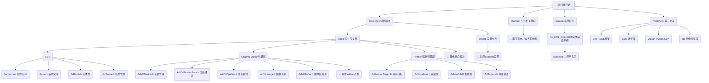

# 基于Vulkan的ECS架构3D渲染引擎

## 项目概述

本项目是一个基于Vulkan图形API的现代化3D渲染引擎，采用Entity-Component-System (ECS)架构设计模式。项目实现了完整的渲染管线，支持3D模型渲染、材质系统、纹理贴图等功能，并通过ECS架构提供了灵活的场景管理能力。

## 项目结构

```mermaid
graph TD
    A[项目根目录] 
    A --> B(Core 核心引擎模块)
    B --> B1(public 公共头文件)
    B1 --> B1a(ECS)
    B1a --> B1a1(Component 组件定义)
    B1a --> B1a2(System 系统实现)
    B1a --> B1a3(AdEntity.h 实体类)
    B1a --> B1a4(AdScene.h 场景管理)
    B1 --> B1b(Graphic Vulkan封装层)
    B1b --> B1b1(AdVKDevice.h 设备管理)
    B1b --> B1b2(AdVKRenderPass.h 渲染通道)
    B1b --> B1b3(AdVKPipeline.h 图形管线)
    B1b --> B1b4(AdVKImage.h 图像资源)
    B1b --> B1b5(AdVKBuffer.h 缓冲区资源)
    B1b --> B1b6(... 其他Vulkan对象)
    B1 --> B1c(Render 渲染管理层)
    B1c --> B1c1(AdRenderTarget.h 渲染目标)
    B1c --> B1c2(AdRenderer.h 渲染器)
    B1c --> B1c3(AdMesh.h 网格数据)
    B1c --> B1c4(AdTexture.h 纹理资源)
    B1 --> B1d(... 其他核心模块)
    B --> B2(private 实现文件)
    B2 --> B2a(... 对应public的实现)
    A --> C(Platform 平台相关代码)
    C --> C1(... 窗口系统、输入系统等)
    A --> D(Sample 示例应用)
    D --> D1(04_ECS_Entity ECS实体渲染示例)
    D1 --> D1a(Main.cpp 主应用入口)
    A --> E(ThirdParty 第三方库)
    E --> E1(EnTT ECS框架)
    E --> E2(GLM 数学库)
    E --> E3(Vulkan Vulkan SDK)
    E --> E4(stb 图像加载库)
```

